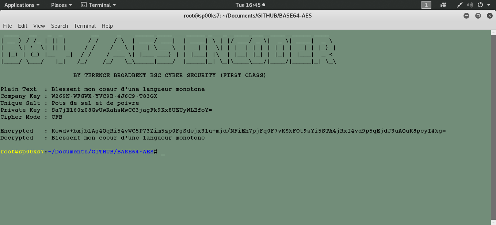

# BASE64/AES ENCODER
### A SIMPLE PYTHON SCRIPT FILE TO CREATE AND READ BASE64/AES ENCODED TEXT STRINGS VIA A CORPORATE 'PASSWORD BASED KEY DERIVATION FUNCTION' (PBKDF2).
Usage: python base64_aes.py

| LANGUAGE | FILENAME      | MD5 HASH                         |
|------    |------         | -------                          |
| python   | base64_aes.py | 1511ac1356ffc7753872039eb307fece |

 

- [x] Confidentiality mode used: CFB - see https://csrc.nist.gov/Projects/Block-Cipher-Techniques/BCM

Cipher Feedback (CFB) is an IV-based encryption scheme, the mode is secure as a probabilistic encryption scheme, achieving indistinguishability from random bits, assuming a random IV. However, confidentiality is not achieved if the IV is predictable, nor if it is made by a nonce enciphered under the same key used by the scheme, as the standard incorrectly suggests to do. Ciphertexts are malleable. No CCA-security. Encryption inefficient from being inherently serial. Scheme depends on a parameter s, 1 ≤ s ≤ n, typically s = 1 or s = 8. Inefficient for needing one blockcipher call to process only s bits. The mode achieves an interesting  “self-synchronization” property; insertion or deletion of any number of s-bit characters into the ciphertext only temporarily disrupts correct decryption.

In cryptography, PBKDF1 and PBKDF2 (Password-Based Key Derivation Function 2) are key derivation functions with a sliding computational cost, used to reduce vulnerabilities to brute force attacks. PBKDF2 is part of RSA Laboratories' Public-Key Cryptography Standards (PKCS) series, specifically PKCS #5 v2.0, also published as Internet Engineering Task Force's RFC 2898. It supersedes PBKDF1, which could only produce derived keys up to 160 bits long. RFC 8018 (PKCS #5 v2.1), published in 2017, recommends PBKDF2 for password hashing.

## CONSOLE DISPLAY
	

Other modes available:-

> ECB: A blockcipher, the mode enciphers messages that are a multiple of n bits by separately enciphering each n-bit piece.
> The security properties are weak, the method leaking equality of blocks across both block positions and time. 
> Of considerable legacy value, and of value as a building block for other schemes, but the mode does not achieve any generally desirable security goal in its own right and must be used with considerable caution; ECB should not be regarded as a “general-purpose” confidentiality mode.

> CBC: An IV-based encryption scheme, the mode is secure as a probabilistic encryption scheme, achieving indistinguishability from random bits, assuming a random IV. 
> Confidentiality is not achieved if the IV is merely a nonce, nor if it is a nonce enciphered under the same key used by the scheme, as the standard incorrectly suggests to do. 
> Ciphertexts are highly malleable. 
> No chosen ciphertext attack (CCA) security. 
> Confidentiality is forfeit in the presence of a correct-padding oracle for many padding methods.
> Encryption inefficient from being inherently serial.
> Widely used, the mode’s privacy-only security properties result in frequent misuse.
> Can be used as a building block for CBC-MAC algorithms. I can identify no important advantages over CTR mode.

OFB: An IV-based encryption scheme, the mode is secure as a probabilistic encryption scheme, achieving indistinguishability from random bits, assuming a random IV. Confidentiality is not achieved if the IV is a nonce, although a fixed sequence of IVs (eg, a counter) does work fine. Ciphertexts are highly malleable. No CCA security. Encryption and decryption inefficient from being inherently serial. Natively encrypts strings of any bit length (no padding needed). I can identify no important advantages over CTR mode.

CTR: An IV-based encryption scheme, the mode achieves indistinguishability from random bits assuming a nonce IV. As a secure nonce-based scheme, the mode can also be used as a probabilistic encryption scheme, with a random IV. Complete failure of privacy if a nonce gets reused on encryption or decryption. The parallelizability of the mode often makes it faster, in some settings much faster, than other confidentiality modes. An important building block for authenticated-encryption schemes. Overall, usually the best and most modern way to achieve privacy-only encryption.

XTS: An IV-based encryption scheme, the mode works by applying a tweakable blockcipher (secure as a strong-PRP) to each n-bit chunk. For messages with lengths not divisible by n, the last two blocks are treated specially. The only allowed use of the mode is for encrypting data on a block-structured storage device. The narrow width of the underlying PRP and the poor treatment of fractional final blocks are problems. More efficient but less desirable than a (wide-block) PRP-secure blockcipher would be.
